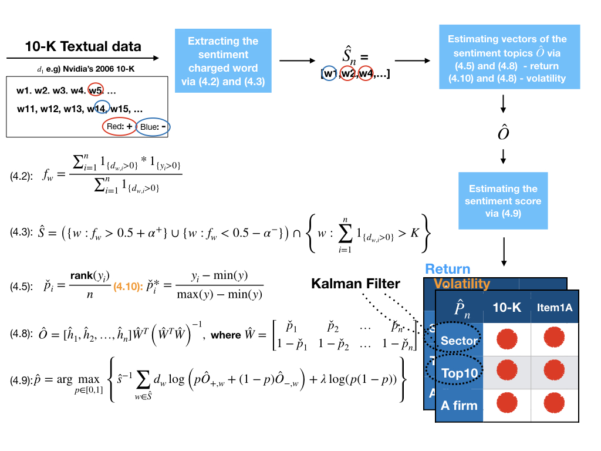

# supervised-financial-sentiment
A supervised learning framework for generating sentiment metrics from 10-K filings, designed to predict asset returns and volatility with high explanatory power.

## 1. Why did you start your project?

This project was initiated to explore the predictive power of 10-K regulatory filings, especially the risk factor section (Item 1A), on stock return and volatility. Given the increasing reliance on unstructured textual data in financial markets, the goal was to develop a supervised learning framework that generates sentiment scores from 10-K filings to support investment strategies across firm, portfolio, and sector levels. Prior research had shown significant market reaction to such filings, but few had explored return *and* volatility prediction using a scalable, automated sentiment analysis pipeline.

## 2. What issues did you find technically and in a domain context?

### Domain Issues:
- The risk factor disclosures in 10-Ks are known to be biased or overly generic due to managerial incentives.
- Textual data is high-dimensional and noisy, making it difficult to extract actionable insights directly.

### Technical Issues:
- HTML parsing of unstructured 10-K documents, especially identifying and extracting the "Item 1A Risk Factors" section accurately.
- Differentiating sentiment-charged vs. neutral words for supervised learning.
- Calibrating the sentiment model to reflect both return and volatility—two fundamentally different financial targets.
- Dealing with noise in time-series sentiment trends across the sector level.

## 3. What solutions did you consider?

- **Manual labeling vs. automatic supervised learning**: Manual labeling was ruled out due to cost and subjectivity. A supervised lexicon learning model based on returns/volatility was adopted .
- **Deep learning (BERT) vs. transparent models**: Chose a transparent, lightweight statistical model over black-box deep learning to retain interpretability and speed.
- **LM Dictionary vs. Model-Derived Lexicon**: While LM was used as a benchmark, the model derived its own sentiment lexicon directly from labeled return/volatility data.
- **Raw scores vs. Smoothed metrics**: Applied the Kalman Filter to smooth time-series sector and portfolio sentiment data for better signal stability.

## 4. What is your final decision among solutions?

The final system comprises an end-to-end pipeline with:

- **10-K Filing Extraction Model**: A scalable parser using regular expressions and HTML heuristics to extract both full text and Item 1A sections from EDGAR filings.
- **Sentiment Score Prediction Model**: A supervised lexicon learning framework that estimates sentiment scores using returns and volatility as labels.
- **Kalman Filter**: For smoothing sector- and portfolio-level sentiment trends.

**Sentiment Score Prediction Model**

This approach generated 12 different sentiment metrics (3 levels × 2 sections × 2 labels), which were quantitatively evaluated using Pearson correlation and qualitatively via the most influential words. The solution balances interpretability, scalability, and financial relevance—pushing the frontier of sentiment-driven market prediction from regulatory filings.

# Abstract
This paper introduces an automated system that generates sentiment metrics to support the prediction of stock returns and volatility. It focuses on three key stakeholder levels: sector, portfolio, and firm. Our system consists of two main components: the SEC Filing Extraction Model and the Supervised Lexicon Learning Model(or the Sentiment Score Prediction Model). The SEC Filing Extraction Model is responsible for preprocessing SEC filings, facilitating seamless integration with the subsequent Supervised Lexicon Learning Model. The lexicon model operates through a fourstage process: (i) identification of sentiment-charged words via predictive filtering, (ii) assignment of prediction weights to these tokens using topic modelling techniques, (iii) estimation of the most probable sentiment score by aggregating the weighted tokens through penalised likelihood, and (iv) application of the Kalman Filter for sector or portfolio sentiment trend analysis. In our empirical study, we study one of the most comprehensive and essential documents about a public firm - 10-K filling, and its Item1A risk factor section. At the sector level, our 10-K-centred model outperforms our risk-factor-centred model in extracting return/volatility-predictive signals in the context. At the portfolio level, both models excel in identifying return/volatility-predictive signals within the context. We recommend, at the company level, the risk model for trend and correlation analysis while advising both models for word analysis.

## Keywords
Sentiment Analysis, Fundamental Analysis, Data Orchestration, Machine Learning, Return, Volatility, 10-K fillings

---
# Findings
## Sentiment-Enhanced ARIMAX for Equity Forecasting (2012–2024)

## Project Overview

This project extends a baseline **ARIMAX model** with **alternative sentiment data** to forecast daily returns for **Apple, Nvidia, and Tesla (2012–2024)**.
This work incorporates **buy-side analyst reports, earnings calls, and sector-level sentiment** to test whether such signals contain tradable alpha.

---

## Motivation

Most candidates and projects focus on running ARIMA/ARIMAX on coarse price data.
This project goes further by:

* **Building sentiment features from alternative data sources**.
* **Designing a leakage-safe time-series CV pipeline** for realistic forecasting.
* **Evaluating with quant trading metrics** (Sharpe ratio, hit-rate), not just statistical fit (R²).

---

## Methodology

### 1. Data

* Target: **next-day log returns** of Apple, Nvidia, Tesla.
* Features (exogenous regressors):

  * **SEC 10K/Q sentiment** (`sec_vol`, `sec_ret`)
  * **Earnings call sentiment** (`calls_vol`, `calls_ret`)
  * **Buy-side analyst report sentiment** (`report_vol`, `report_ret`)

### 2. Model

* **ARIMAX**.
* Structure:
  * **AR** → captures momentum / mean reversion.
  * **MA** → captures shock persistence.
  * **Exogenous regressors** → capture external signals (sentiment, volatility).
  * **Error term** → market noise, tested with Ljung–Box, Jarque–Bera, heteroskedasticity diagnostics.

### 3. Validation

* **Expanding-window cross-validation** (5 folds).
* **No leakage**: joint NaN handling, fold-by-fold scaling of features.
* **Evaluation metrics**:

  * **R²** (variance explained, expected near 0 for daily returns).
  * **Hit-rate** (% correct directional predictions).
  * **Sharpe ratio** (risk-adjusted profitability of long/short strategy).

### 4. Ablation Testing

* Baseline ARIMA (no exogenous).
* ARIMAX with individual sentiment groups (SECs / Calls / Reports).
* ARIMAX with all features combined.

---

##  Key Findings

### Apple (2012–2024)

* **Buy-side analyst reports alone** gave the strongest signal (Sharpe \~2.3).
* Combining all features diluted performance.

### Nvidia (2012–2024)

* **Analyst reports** were strong (Sharpe \~2.2).
* **Combining all signals** improved further (Sharpe \~2.3) → Nvidia is multi-narrative driven (AI, gaming, crypto).

### Tesla (2012–2024)

* **Analyst reports dominated** (Sharpe \~1.6–2.0).
* Other signals (sector, calls) degraded performance.

### Across all firms

* **Baseline ARIMA was useless** (Sharpe \~0).
* **R² ≈ 0 throughout** (as expected).
* **Sharpe ratio revealed tradability** → buy-side analyst sentiment is the most robust alpha source.

---
* **R² is meaningless for returns** — must evaluate with Sharpe and hit-rate.
* **Ablation studies matter** — extra signals can dilute or complement alpha.
* **Firm-specific differences exist**:

  * Apple/Tesla → report-only signals dominate.
  * Nvidia → combination of signals helps.
* **Realistic pipeline** (walk-forward CV, leakage checks, trading metrics) is what differentiates real quant research from toy models.
---

## 📈 Example Result (Tesla, 2012–2024)

| Group      | R²     | Hit-rate | Sharpe      |
| ---------- | ------ | -------- | ----------- |
| ARIMA      | \~0    | 21%      | 0.36        |
| ReportOnly | 0.005  | 48%      | **1.6–2.0** |
| All        | -0.003 | 47%      | 1.2–1.9     |
| CallsOnly  | -0.004 | 44%      | 0.29        |
| SecOnly    | -0.015 | 42%      | -0.31       |

---
